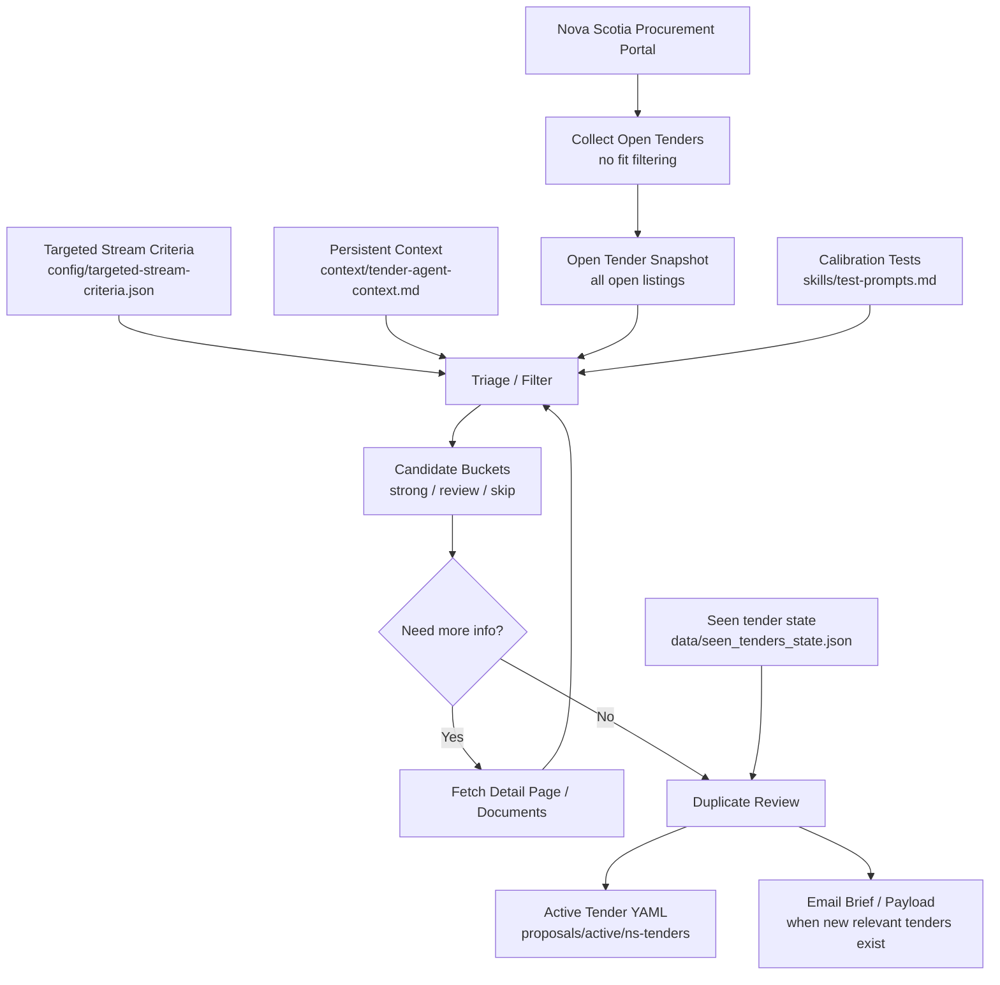

# Tender Agent Flow

Tender Agent owns the public tender source, screening, import, and intake evidence workflow. It stores artifacts produced by the local `ns-tender-monitor` skill script; it does not include a compiled app.

## Workflow Contracts

| Stage | Owns | Output |
| --- | --- | --- |
| Collect open | Fetch every currently open tender listing without filtering by fit. | Complete open-tender snapshot under `data/open-tenders/runs/` and latest database at `data/open-tenders/open-tenders-latest.json`. |
| Triage/filter | Apply targeted stream criteria and domain-relevance rules to the snapshot. | Strong, review, skip, and false-positive buckets. |
| Enrich | Revisit portal/detail documents only when a candidate needs more context. | Better evidence and confidence. |
| State file | Preserve seen tender IDs across runs. | Duplicate-prevention history in `data/seen_tenders_state.json`. |
| Run wrapper | Capture repo state, monitor command, summary path, matches, and errors. | JSON run log. |
| Human review | Confirm scope, addenda, eligibility, mandatory meetings, and submission rules. | Go/no-go decision and next action. |
| Email handoff | Send only public-safe concise briefs for newly relevant tenders. | Email brief/payload evidence. |

## Working Rule

Every real pursuit still requires human verification in the live procurement portal. The public notice and generated analysis are intake evidence, not a substitute for downloading tender documents, addenda, submission instructions, forms, and eligibility requirements.

Optional LLM use must receive only public-safe or redacted context. Do not send internal roster, company strategy, redaction maps, private proposal content, or non-public pursuit notes externally.

## Targeted Stream

The normal stream is civil, municipal, and transportation professional services. Strong examples include roads, streets, highways, corridors, intersections, active transportation, traffic, transit, stormwater, wastewater, municipal infrastructure, hydraulic studies, feasibility studies, design studies, and condition assessments.

Generic consulting, corporate advisory work, vehicles, equipment, supplier-style tenders, goods-only procurement, and unrelated services are off-profile and should not enter the normal qualified-opportunity email.
