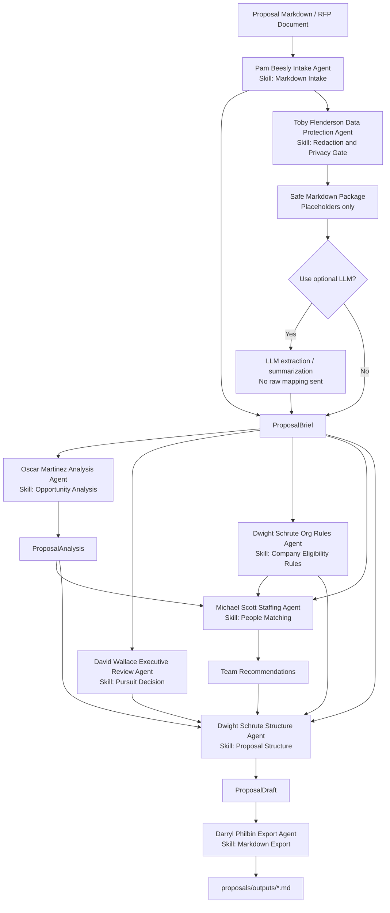

# Proposal Agent Flow

The system is organized as a small set of agents. Each agent has one skill contract, clear inputs, clear outputs, and checks that make its result reviewable.

## Agent Skills

| Agent | Skill | Owns |
| --- | --- | --- |
| Pam Beesly Intake Agent | Markdown Intake | Load Markdown proposals, YAML/JSON metadata, MarkItDown text, and team rosters. |
| Toby Flenderson Data Protection Agent | Redaction and Privacy Gate | Redact sensitive proposal, client, company, OC, and people data before optional LLM use. |
| Oscar Martinez Analysis Agent | Opportunity Analysis | Extract keywords, required roles, win themes, and risks. |
| David Wallace Executive Review Agent | Pursuit Decision | Score strategic value and decide pursue, conditional pursue, or leadership review. |
| Dwight Schrute Org Rules Agent | Company Eligibility Rules | Apply project level, region, OC, PM, and sister-company eligibility logic. |
| Michael Scott Staffing Agent | People Matching | Rank people against keywords, roles, industry, project history, and availability. |
| Dwight Schrute Structure Agent | Proposal Structure | Build the sections and make sure risks, criteria, and team roles are represented. |
| Darryl Philbin Export Agent | Markdown Export | Render the final analysis and draft in a stable Markdown format. |

## Working Rule

Every proposal should start as Markdown in `proposals/active`. The front matter is the structured metadata. The body is the source material: MarkItDown output, addenda, notes, and internal pursuit context.
