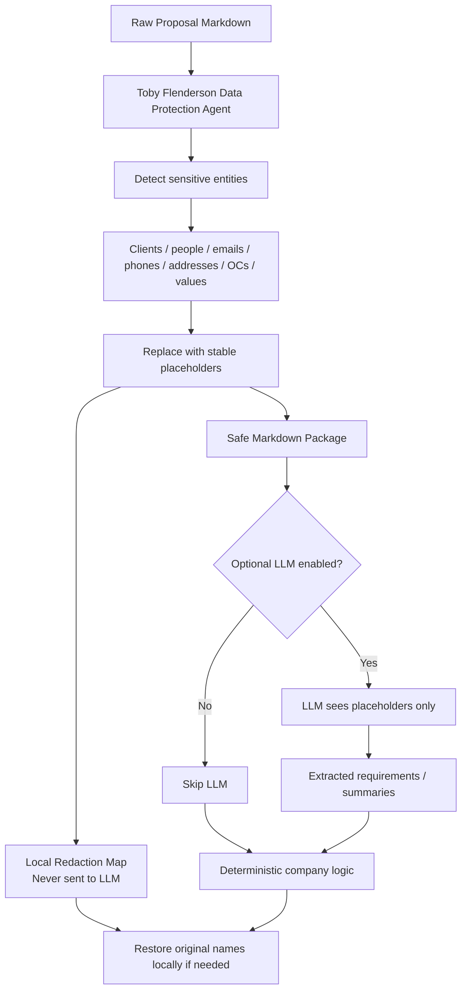
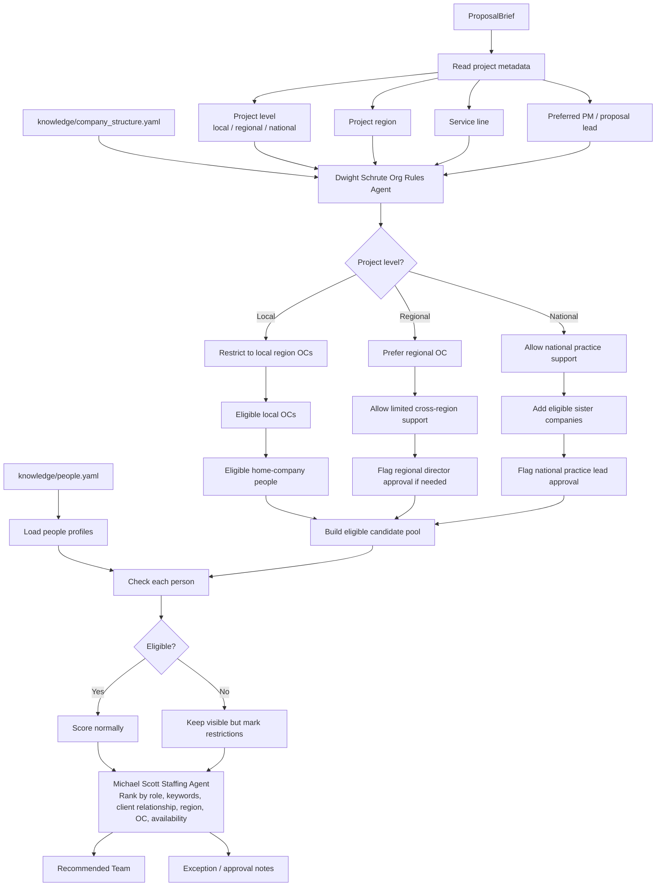

# Company Infrastructure

The proposal brain uses company knowledge before it recommends people.

## Knowledge Files

```text
knowledge/
  company_structure.yaml
  people.yaml
```

`company_structure.yaml` defines:

- home company
- regions
- offices
- operating centres
- service lines
- OC managers
- sister companies
- executive approval threshold

`people.yaml` defines:

- person role
- company
- region
- office
- operating centre
- seniority
- proposal leadership eligibility
- skills
- industries
- past projects
- client relationships
- availability

## Decision Order

1. Determine project level: local, regional, or national.
2. Determine project region and service line.
3. Build eligible operating centres.
4. Build eligible company pool.
5. Flag approval requirements.
6. Rank people inside the eligible pool first.
7. Keep restricted people visible with exception reasons.

This lets the agent explain why a local project should stay in a local OC, why a national project can use sister-company support, and when leadership approval is required.

## Data Protection Layer



## Team Selection Chart


